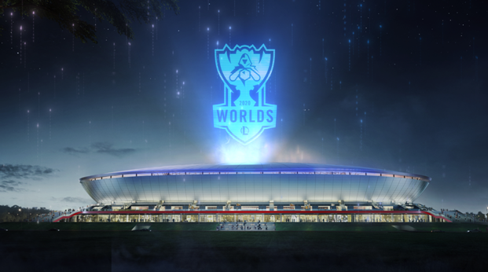

<html lang="zh">
	<head>
		<meta charset="UTF-8">
		<meta name="viewport" content="width=device-width, initial-scale=1.0">
		<meta http-equiv="X-UA-Compatible" content="ie=edge">
		<link rel="stylesheet" type="text/css" href="css/about.css" />
		<title>欢乐联盟</title>
		<link rel="icon" href="img/logo-public.png" type="image/x-icon">
		
	</head>
	<body>
		

			

				

					<h4><a href="index.html">League of Legends</a></h4>
				

				

					<ul>
						<li><a href="xiaomo.html">小莫</a></li>
						<li><a href="naihe.html">奈何</a></li>
						<li><a href="mao.html">猫</a></li>
						<li><a href="longfan.html">小帆</a></li>
					</ul>
				

			

			

				欢迎来到召唤师联盟
				

				
					

						<input type="radio" name="r" id="r1" checked />
						<input type="radio" name="r" id="r2" />
						<input type="radio" name="r" id="r3" />
						<input type="radio" name="r" id="r4" />
						<input type="radio" name="r" id="r5" />
						

							
						

						

							
						

						

							
						

						

							
						

						

							
						

				
						

							<label for="r1" class="bar"></label>
							<label for="r2" class="bar"></label>
							<label for="r3" class="bar"></label>
							<label for="r4" class="bar"></label>
							<label for="r5" class="bar"></label>
						

					

				

			

			

				copyright: &nbsp; 欢乐联盟
			

		

		<audio src="audio/Free Loop.mp3" autoplay loop>
			当前浏览器不支持audio
		</audio>
	</body>
</html>
